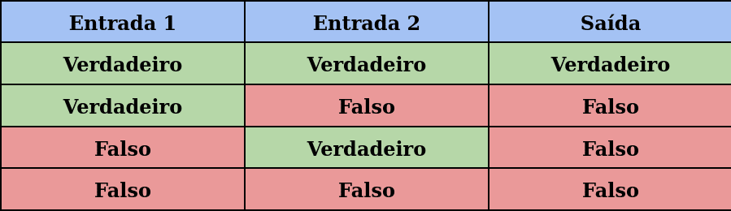
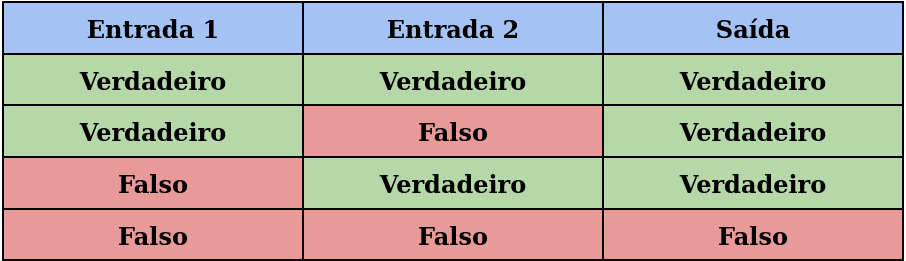
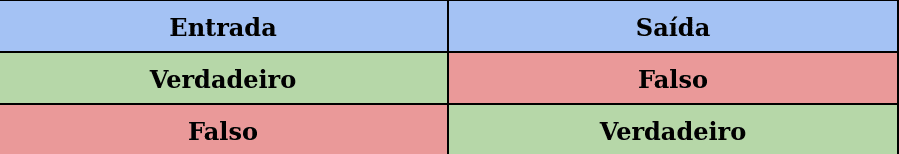

# Continuação aula 2 e exercícios práticos

### Concatenação
  <b>Tradicional: </b> Através do + conseguimos unir textos com variaveis.
  
  <b>Template string: </b> Através do da crase envolvendo toda a frase, adicionando as variaveis dentro do `${}` conseguimos unir textos e variáveis.

```javascript
const nomePais = "Brasil";
const capitalPais= "Brasilia";
const quantidadeEstados = 26;

// Tradicional
console.log("Meu nome é Ana e moro no " + nomePais + " que tem " + capitalPais + " como capital. Aqui sou muito feliz pois tenho "+ quantidadeEstados + " estados para desbravar!");

// Template string
console.log(`Meu nome é Ana e moro no ${nomePais} que tem ${capitalPais} como capital. Aqui sou muito feliz pois tenho ${quantidadeEstados} estados para desbravar!`);
```

#### Bora praticar 
Abra o VSCode
  
  <details>
    <summary>Pratica 3: Crie as seguintes constantes e em seguida use a criatividade para concatená-las formando uma frase: primeiro nome; último nome; ano de nascimento; cor preferida; hobby; um sentimento.
    </summary>
 

```javascript

      const primeiroNome = "Ana"
      const ultimoNome = "Santos"
      const anoDeNascimento = 2001
      const corPreferida = "laranja"
      const hobbie = "fazer natacao"
      const sentimento = "felicidade, porque sextou, bb!!"

      console.log(`Meu nome é ${primeiroNome} ${ultimoNome}. Nascida no ano de ${anoDeNascimento}. Minha cor favorita é ${corPreferida}. Meu hobbie é ${hobbie} e meu atual sentimento é ${sentimento}`)

```
  </details>
   
### Manipulação de strings

Existem algumas formas de manipular string: 
- `length` checa o tamanho da string;
- `toUpperCase` converte todos os caracteres de uma string para maiúsculas;
- `toLowerCase` converte todos os caracteres de uma string para minúsculas;
- `trim` remove espaços em branco no início e no fim da string;
- `split` separa uma string definindo um limitador;
- `replace` substitui trechos da string;
- `slice` retorna só um trecho da string;
- `includes` verifica se um valor está presente na string, retornando true ou false;
- `startsWith` verifica se a string começa com um valor específico;
- mais: https://developer.mozilla.org/en-US/docs/Web/JavaScript/Reference/Global_Objects/String 


## Operadores aritméticos e lógicos
Os operadores aritméticos são usados para realizar cálculos matemáticos em linguagens de programação.

```javascript
const soma = 10 + 2;
const subtracao = 10 - 2;
const multiplicacao = 10 * 2;
const divisao = 10 / 2;
```

Além dos mais comuns citados acima existe também o módulo da divisão que consiste no resto da divisão de dois números.

```javascript
const moduloDaDivisao = 10 % 10;
```

<p align="center">
  
</p> 

### Operadores de comparação e lógico
Os operadores lógicos são símbolos ou palavras que são utilizados para conectar mais de uma expressão, mais corriqueiramente dentro de uma linguagem de programação. 

```javascript
// Comparação
const estritamenteIgual = 10 === 10;
const estritamenteDiferente = 10 !== 10;
const maiorQue = 10 > 10;
const maiorOuIgualQue = 10 >= 2;
const menorQue = 2 < 10;
const menorOuIgualQue = 10 <= 10;

// Lógicos
const and_e = estritamenteIgual && maiorQue;    // todas as condicoes devem ser atendidas para que o resultado seja verdadeiro
const or_ou = maiorQue || estritamenteDiferente; // pelo menos uma condicao deve ser atendida para que o resultado seja verdadeiro
const not_nao = !estritamenteDiferente; // inverte o resultado final
```

#### Tabela verdade operador lógico AND (e)
<p align="center">
  
</p> 

#### Tabela verdade operador lógico OR (ou)
<p align="center">
  
</p> 

#### Tabela verdade operador lógico NOT (nao)
<p align="center">
  
</p> 

#### Bora praticar!!
Abra o VSCode

<details>
  <summary>Pratica 4: crie 2 constantes: numero1 e numero2, cada uma contendo um valor numérico. Em seguida, crie mais 5 constantes: soma, subtração, multiplicação, divisão e modulo, que contenha as reespectivas operações usando as constantes numero1 e numero2</summary>

```javascript
const numero1 = 10;
const numero2 = 4;

const soma = numero1+numero2;
const subtracao = numero1-numero2;
const multiplicacao= numero1*numero2;
const divisao= numero1/numero2;
const modulo= numero1%numero2;
```
</details>


<details>
  <summary>Prática 5: usando as propriedades e métodos de string apresentados, faça:
  - exiba o tamanho do nome completo (primeiro nome + espaço + último nome) <br>
  - exiba o nome completo em letras maiúsculas <br>
  - exiba o nome completo em letras minúsculas <br>
  - verifique se o sentimento contém a palavra "sextou" usando <b>includes<b>
  </summary>

```javascript
  const nomeCompleto = "Ana Beatriz dos Santos"
  const sentimento = "felicidade, porque sextou, bb!!"
  const tamanhoSemEspacos = nomeCompleto.replace(/ /g, "").length;

  // tamanho do nome completo
  console.log(`Tamanho do nome completo: ${nomeCompleto.length}`)

  // tamanho do nome sem espaço
  console.log(`Tamanho do nome completo sem espaços: ${tamanhoSemEspacos}`);

  // nome completo em letras maiúsculas
  console.log(`Nome completo em letras maiúsculas: ${nomeCompleto.toUpperCase()}`);

  // nome completo em letras minúsculas
  console.log(`Nome completo em letras minúsculas: ${nomeCompleto.toLowerCase()}`);

  // Verificar se o sentimento contém a palavra "feliz"
  console.log(`Sentimento inclui "sextou": ${sentimento.includes("sextou")}`);

```
</details>

<details>
  <summary>Prática 6: operações aritméticas. Crie duas constantes e exiba os cálculos no console: <br>
  - idade: calcule a idade do seu amigo com base no ano atual <br>
  - anosAte100: calcule quantos anos faltam para ele completar 100 anos

  </summary>

```javascript

const anoAtual = 2024;
const anoDeNascimento = 2001;

const idade = anoAtual - anoDeNascimento;
const anosAte100 = 100 - idade;

console.log(`Idade: ${idade}`);
console.log(`Anos até 100: ${anosAte100}`);
  
```
</details>

<details>
  <summary>Prática 7: operadores lógicos. Você é a segurança de uma festa e só permite a entrada de pessoas que: <br>
  - têm mais de 18 anos E <br>
  - estão vestindo roupas formais OU têm o convite VIP <br>

  <br>

  Crie 3 variaveis: idade, roupaFormal (booleano) e temConviteVIP (booleano) e use operadores lógicos para determinar se a pessoa pode entrar ou não. 

</summary>

```javascript

const idade = 20;
const roupaFormal = true;
const temConviteVIP = false;

const podeEntrar = idade > 18 && (roupaFormal || temConviteVIP);
console.log(`Pode entrar na festa: ${podeEntrar}`);

```
</details>