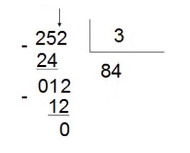

# Continuação aula 2 e exercícios práticos

### Concatenação
  <b>Tradicional: </b> Através do + conseguimos unir textos com variaveis.
  
  <b>Template string: </b> Através do da crase envolvendo toda a frase, adicionando as variaveis dentro do `${}` conseguimos unir textos e variáveis.

```javascript
const nomePais = "Brasil";
const capitalPais= "Brasilia";
const quantidadeEstados = 26;

// Tradicional
console.log("Meu nome é Ana e moro no " + nomePais + " que tem " + capitalPais + " como capital. Aqui sou muito feliz pois tenho "+ quantidadeEstados + " estados para desbravar!");

// Template string
console.log(`Meu nome é Ana e moro no ${nomePais} que tem ${capitalPais} como capital. Aqui sou muito feliz pois tenho ${quantidadeEstados} estados para desbravar!`);
```

#### Bora praticar 
Abra o VSCode
  
  <details>
    <summary>Pratica 3: Crie as seguintes constantes e em seguida use a criatividade para concatená-las formando uma frase: primeiro nome; último nome; ano de nascimento; cor preferida; hobby; um sentimento.
    </summary>
   </details>
   
### Manipulação de strings

Existem algumas formas de manipular string: 
- `length` checa o tamanho da string;
- `toUpperCase` converte todos os caracteres de uma string para maiúsculas;
- `toLowerCase` converte todos os caracteres de uma string para minúsculas;
- `trim` remove espaços em branco no início e no fim da string;
- `split` separa uma string definindo um limitador;
- `replace` substitui trechos da string;
- `slice` retorna só um trecho da string;
- `includes` verifica se um valor está presente na string, retornando true ou false;
- `startsWith` verifica se a string começa com um valor específico;
- mais: https://developer.mozilla.org/en-US/docs/Web/JavaScript/Reference/Global_Objects/String 


## Operadores aritméticos e lógicos
Os operadores aritméticos são usados para realizar cálculos matemáticos em linguagens de programação.

```javascript
const soma = 10 + 2;
const subtracao = 10 - 2;
const multiplicacao = 10 * 2;
const divisao = 10 / 2;
```

Além dos mais comuns citados acima existe também o módulo da divisão que consiste no resto da divisão de dois números.

```javascript
const moduloDaDivisao = 10 % 10;
```

<p align="center">
  
</p> 

### Operadores de comparação e lógico

```javascript
// Comparação
const estritamenteIgual = 10 === 10;
const estritamenteDiferente = 10 !== 10;
const maiorQue = 10 > 10;
const maiorOuIgualQue = 10 >= 2;
const menorQue = 2 < 10;
const menorOuIgualQue = 10 <= 10;

// Lógicos
const and_e = estritamenteIgual && maiorQue;
const or_ou = maiorQue || estritamenteDiferente;
const not_nao = !estritamenteDiferente;
```

#### Bora praticar 
Abra o VSCode

<details>
  <summary>Pratica 4: crie 2 constantes: numero1 e numero2, cada uma contendo um valor numérico. Em seguida, crie mais 5 constantes: soma, subtração, multiplicação, divisão e modulo, que contenha as reespectivas operações usando as constantes numero1 e numero2</summary>

```javascript
const soma = numero1+numero2;
const subtracao = numero1-numero2;
const multiplicacao= numero1*numero2;
const divisao= numero1/numero2;
const modulo= numero1%numero2;
```
</details>