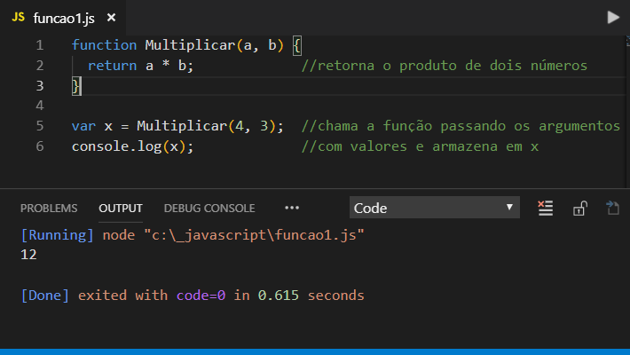

## 🔁 Estruturas de repetição

As estruturas de repetição repetem determinado bloco de comandos enquanto a condição atende ao requisito. As estruturas de repetição são representadas por `while`, `do while` e `for`.
  
### while

`while` cria um laço que executa um bloco de comando especifico enquanto a condição de teste for avaliada como verdadeira. A condição é avaliada antes da execução do bloco.

```javascript
while (condicao){
  declaracao;
}
```

### Exemplo 1

Vamos declarar uma variável e iniciá-la em 0 para, em seguida, usar o `while` e passar a instrução que, enquanto nossa variável for menor que 11, a multiplicaremos por 5 (resultando na tabuada do 5).

```javascript
let i = 0;

while(i<11){
    console.log(`${i} x 5 = ${i*5}`)
    i++ // NUNCA ESQUECER DESSE INCREMENTADOR P/ SAIR DO WHILE QND ATINGIR A CONDICAO. CASO CONTRARIO ENTRARÁ NO LOOP INFINITO
}
 ```

 ```javascript
 // passar por todos os caracteres de uma palavra 

let nome = "Ana Beatriz";
let i = 0;

while(i <= 10){
    console.log(nome[i])
    i++ 
}
 ```
 
### do while

`do while` é parecido com while, mas nele a condição só acontece depois que os comandos do bloco forem executados.

```javascript
do{
  declaracao
}while (condicao);
```

### Exemplo 2
Vamos declarar uma variável e iniciá-la em 0. Enquanto for menor que 5 (condição passada no bloco `do while`), ela passará novamente pelo bloco do e acrescentará um número inicial de variável.

```javascript
let i = 0;

do {
    console.log("O contador vale:" + i);
    i++;
} while (i < 5)
```

#### 🏋🏽 Bora praticar 
  Abra o Visual Studio 

 <details>  
 <summary><b>Pratica 1:</b> Faça um algoritmo que imprima todos os números ímpares entre 1 e 20 utilizando o laço `while`.</summary>
 
 ```javascript
let i = 1; // Contador

while (i <= 20) {
    if (i % 2 !== 0) { // Verifica se o número é ímpar
        console.log(i);
    }
    i++; // Incrementa o contador
}
```
</details>

E se eu quiser visualizar todos os números pares entre 1 e 20?
 
 <details> <summary><b>Prática 2:</b> Faça um algoritmo que conte de 10 até 1 (contagem regressiva) utilizando o laço `while`.</summary>

```javascript
let i = 10; // início da contagem regressiva

while (i >= 1) {
    console.log(i);
    i--; // decrementa o contador
}

console.log("Lançar!");
```

 </details>

## Funções
As funções no JavaScript permitem agrupar blocos de código que realizam uma tarefa específica e reutilizá-los ao longo do programa. Elas podem receber parâmetros e retornar um valor.

<p align="center">
   
</p>

### Criando uma função
  - <b>Função tradicional:</b> definida com a palavra-chave function.

  - <b>Arrow function:</b> introduzida no ES6 (ECMAScript 6), possui uma sintaxe mais concisa e elegante. São especialmente úteis para funções que podem ser expressas em uma única linha (e que será usada apenas uma vez).

```javascript

// função tradicional
function saudar(nome) {
  return `Olá, ${nome}!`;
}

// arrow function -> função da seta
const saudarArrow = (nome) => `Olá, ${nome}!`;

// chamando as funções
console.log(saudar("Ana"));
console.log(saudarArrow("Ana"));

```

- <b>Parâmetros:</b> os parâmetros da função são colocados entre parênteses

- <b>Seta:</b> a seta (=>) separa a lista de parâmetros do corpo da função

- <b>Corpo da função:</b> o corpo da função é colocado entre chaves. Se o corpo da função consistir em uma única expressão, as chaves e a palavra-chave return podem ser omitidas.

- <b>Retorno:</b> definido com a palavra-chave return, é o resultado produzido pela função.

```javascript

// função tradicional
function calcularSoma(a, b) {
  return a + b;
}

const resultado = calcularSoma(5, 3); // saida: 8
console.log(resultado);


// arrow function equivalente
const calcularSoma = (a, b) => a + b;

// sem omitir as palavras reservadas e as chaves: const calcularSoma = (a, b) => { return a + b };

```

### Funções sem retorno
Nem todas as funções precisam retornar algo. Algumas apenas executam uma ação.

```javascript

function exibirMensagem() {
  console.log("Essa função não retorna nada!");
}

exibirMensagem();

```

### Funções com valores padrão
Os parâmetros podem ter valores padrão caso não sejam fornecidos.

```javascript

function apresentar(nome = "Visitante", idade = "desconhecida") {
  console.log(`Olá, meu nome é ${nome} e tenho ${idade} anos.`);
}

apresentar(); // Olá, meu nome é Visitante e tenho desconhecida anos.
apresentar("Ana", 23); // Olá, meu nome é Ana e tenho 23 anos.

```

#### Bora praticar 
  Abra o VSCode

  <details>
    <summary>Prática 1: Crie uma função para verificar se um número é par ou ímpar <br> 
    - receba um número como parâmetro. <br>
    - retorne "par" ou "ímpar"
    </summary>
    

```javascript

function verificarParOuImpar(numero) {
    if (numero % 2 === 0) {
        return "par";
    } else {
        return "ímpar";
    }
}

console.log(verificarParOuImpar(7)); // ímpar

```
  </details>


  <details>
    <summary>Prática 2: Crie uma função que conte quantas palavras existem em uma frase. <br> 
    - use o método split para dividir a frase em palavras
    </summary>
    

```javascript

const contarPalavras = (frase) => frase.split(" ").length;

console.log(contarPalavras("JavaScript é uma linguagem divertida!")); // 5

```
  </details>


  